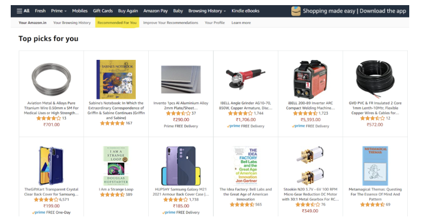

# **Project: Amazon Product Recommendation System** 📦

## Welcome to the project on Recommendation Systems.
 We will work with the Amazon product reviews dataset for this project. The dataset contains ratings of different electronic products. It does not include information about the products or reviews to avoid bias while building the model.

## **Context** 🌐

Today, information is growing exponentially with volume, velocity, and variety throughout the globe. This has led to information overload and too many choices for the consumer of any business. It represents a real dilemma for these consumers, and they often turn to denial. Recommender Systems are one of the best tools that help recommend products to consumers while they are browsing online. Providing personalized recommendations that are most relevant for the user is what's most likely to keep them engaged and help businesses.

E-commerce websites like Amazon, Walmart, Target, and Etsy use different recommendation models to provide personalized suggestions to different users. These companies spend millions of dollars to come up with algorithmic techniques that can provide personalized recommendations to their users.

Amazon, for example, is well-known for its accurate selection of recommendations on its online site. Amazon's recommendation system is capable of intelligently analyzing and predicting customers' shopping preferences in order to offer them a list of recommended products. Amazon's recommendation algorithm is therefore a key element in using AI to improve the personalization of its website. For example, one of the baseline recommendation models that Amazon uses is item-to-item collaborative filtering, which scales to massive data sets and produces high-quality recommendations in real-time.

## **Objective** 🎯

You are a Data Science Manager at Amazon and have been given the task of building a recommendation system to recommend products to customers based on their previous ratings for other products. You have a collection of labeled data of Amazon reviews of products. The goal is to extract meaningful insights from the data and build a recommendation system that helps in recommending products to online consumers.

## **Dataset** 📊

The Amazon dataset contains the following attributes:

- **userId**: Every user identified with a unique id
- **productId**: Every product identified with a unique id
- **Rating**: The rating of the corresponding product by the corresponding user
- **timestamp**: Time of the rating. We **will not use this column** to solve the current problem

## **DataSource**
    Kaggle.com
    

