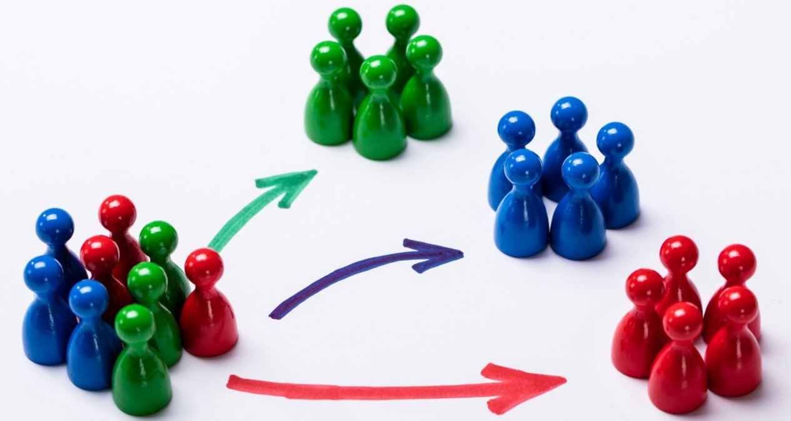

# **Project: Customer Personality Analysis** 📦

## Welcome to the project on Unsupervides ML (Clustering).
Understanding customer behaviors, preferences, and demographics to enhance business strategies and customer experiences. 
This project typically involves unsupervised machine learning techniques to segment customers based on various attributes.

The primary objective is to segment customers into different groups based on their characteristics and behaviors. 
This will help in tailoring marketing strategies, improving customer satisfaction, and optimizing business operations.

## **Dataset** 📊
https://www.kaggle.com/datasets/imakash3011/customer-personality-analysis/data
### People

ID: Customer's unique identifier 

Year_Birth: Customer's birth year

Education: Customer's education level

Marital_Status: Customer's marital status

Income: Customer's yearly household income

Kidhome: Number of children in customer's household

Teenhome: Number of teenagers in customer's household

Dt_Customer: Date of customer's enrollment with the company

Recency: Number of days since customer's last purchase

Complai*n: 1 if the customer complained in the last 2 years, 0 otherwise

### Products

MntWines: Amount spent on wine in last 2 years

MntFruits: Amount spent on fruits in last 2 years

MntMeatProducts: Amount spent on meat in last 2 years

MntFishProducts: Amount spent on fish in last 2 years

MntSweetProducts: Amount spent on sweets in last 2 years

MntGoldProds: Amount spent on gold in last 2 years

### Promotion

NumDealsPurchases: Number of purchases made with a discount

AcceptedCmp1: 1 if customer accepted the offer in the 1st campaign, 0 otherwise

AcceptedCmp2: 1 if customer accepted the offer in the 2nd campaign, 0 otherwise

AcceptedCmp3: 1 if customer accepted the offer in the 3rd campaign, 0 otherwise

AcceptedCmp4: 1 if customer accepted the offer in the 4th campaign, 0 otherwise

AcceptedCmp5: 1 if customer accepted the offer in the 5th campaign, 0 otherwise

Response: 1 if customer accepted the offer in the last campaign, 0 otherwise

### Place

NumWebPurchases: Number of purchases made through the company’s website

NumCatalogPurchases: Number of purchases made using a catalogue

NumStorePurchases: Number of purchases made directly in stores

NumWebVisitsMonth: Number of visits to company’s website in the last month

## **DataSource**
    Kaggle.com
