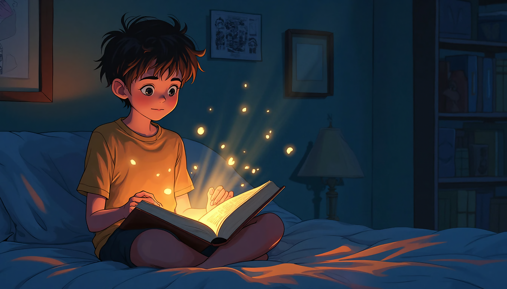

# **Project: 🧸 Bedtime Story Creator using LLM** 📦

Generate whimsical, custom bedtime stories for kids using Python, LangChain, and OpenAI’s GPT magic! Just enter a character and setting—like _"Red car in F1 race"_—and the app will produce a personalized tale, extract a moral, and illustrate the scene.

---

## 🚀 Features

- 📖 AI-generated children’s story
- 💬 Automatic moral extraction
- 🎨 Illustrated scene using OpenAI’s image API
- 🖥️ Interactive Streamlit frontend
- 🔐 Secure use of API keys via `secret_key.py`

---

## 🛠️ Tech Stack

| Technology     | Purpose                                |
|----------------|----------------------------------------|
| Python         | Core programming language              |
| LangChain      | Prompt chaining for story + moral flow |
| OpenAI API     | Text generation + image creation       |
| Streamlit      | Simple UI for user interaction         |

---
