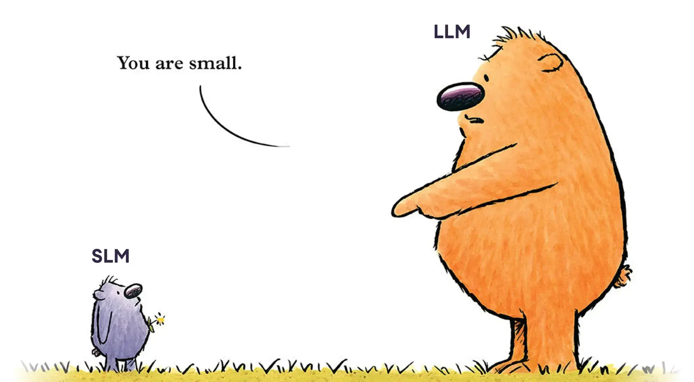

# 🔬 Hybrid LLM Research Lab: SLM vs. LLM Benchmarking

This repository contains a quantitative research framework designed to compare **Local Small Language Models (SLMs)** running via Ollama against **Cloud-based Large Language Models (LLMs)** like Llama 4 Scout. 

The project focuses on three core pillars: **Pedagogical Logic**, **Operational Latency**, and **Economic Feasibility**.

---

## 📊 Research Objectives
* **Performance Metrics:** Quantify TTFT (Time to First Token), TPS (Tokens Per Second), and Total Latency.
* **Economic Analysis:** Calculate the cost-benefit ratio of edge-based inference vs. cloud API egress.
* **Logic Validation:** Evaluate the accuracy of JSON-structured mathematical reasoning across different model scales (1B to 70B+ parameters).

## 🛠️ Tech Stack
* **UI Framework:** [Streamlit](https://streamlit.io/) (Interactive Research Dashboard)
* **Local Inference:** [Ollama](https://ollama.ai/) (Supporting Phi-3, Llama 3.2, etc.)
* **Cloud Inference:** [Groq API](https://groq.com/) (Llama 4 Scout / LPU Acceleration)
* **Language:** Python 3.10+
* **Data Science:** Pandas for statistical logging and CSV aggregation.

---

## 🚀 Getting Started

### 1. Prerequisites
Ensure you have **Ollama** installed and the target models pulled to your local machine:

ollama pull phi3
ollama pull llama3.2:3b

Activate your virtual environment and install dependencies:
pip install streamlit pandas ollama groq python-dotenv

### 3. API Configuration
Create a .env file in the root directory to securely store your Cloud credentials:

Code snippet
GROQ_API_KEY=your_lp_api_key_here

### 4. Run the Benchmarker
Launch the research dashboard:
streamlit run app.py

## 📈 Methodology & Lexicon
For the purpose of this study, performance is categorized by:
TTFT (Time to First Token): Calculated as $Queue\ Time + Prompt\ Prefill\ Time$. This measures the perceived responsiveness.
TPS (Tokens Per Second): The rate of token generation (Throughput).
Economic Impact: Savings calculated based on $0.00 cost for local inference vs. current market rates for Llama 4 Scout ($0.11/$0.34 per 1M tokens).
Syntax Hallucination: A binary metric tracking if the model fails to return valid, parsable JSON.
## 📝 Preliminary Findings
Current data suggests that while Cloud LLMs offer a significant throughput advantage, Local SLMs (specifically Phi-3) maintain a TPS of >10, which exceeds human reading speeds. This justifies the use of Local SLMs for cost-sensitive educational applications where data privacy is a priority.
## 📥 Data Export
All session trials are automatically logged to research_logs.csv. This file is designed for direct ingestion into LaTeX tables for formal academic publishing or IEEE-style documentation.Developed for the "Local SLM vs. Cloud LLM" Technical Research Paper.

