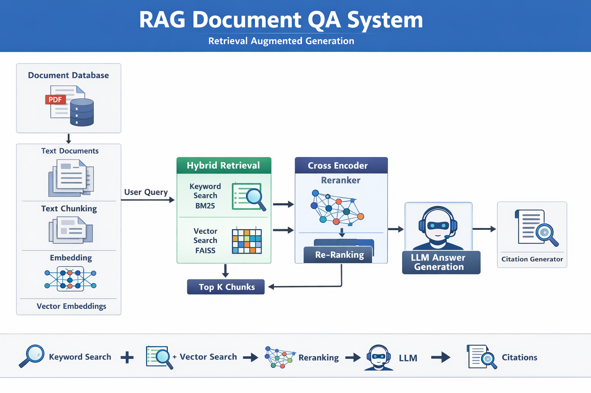

# Production RAG Document QA System

An end-to-end **Retrieval Augmented Generation (RAG)** pipeline that answers questions from documents using hybrid retrieval, reranking, and LLM-based answer generation with source citations.

This project demonstrates how to build a **production-style document question answering system** using modern LLM tooling.

---

## Features

- PDF document ingestion
- Text extraction using pdfplumber
- Semantic chunking
- Embeddings using Sentence Transformers
- Vector similarity search with FAISS
- Keyword search with BM25
- Hybrid retrieval (BM25 + Vector Search)
- Cross-Encoder reranking
- LLM-based answer generation
- Automatic citation generation
- Supports financial documents such as annual reports

---

## Architecture
User Query
↓
Hybrid Retrieval
(BM25 + Vector Search)
↓
Top K Chunks
↓
Cross Encoder Reranker
↓
Relevant Context
↓
LLM Answer Generation
↓
System Generated Citations

---

## Project Pipeline

1. **Document Ingestion**
   - Load PDF documents
   - Extract text from each page

2. **Chunking**
   - Split text into semantic chunks
   - Maintain metadata for citation

3. **Embedding Generation**
   - Use `SentenceTransformer` model
   - Convert chunks into vector embeddings

4. **Vector Database**
   - Store embeddings using FAISS
   - Perform similarity search

5. **Keyword Retrieval**
   - Implement BM25 ranking
   - Capture exact keyword matches

6. **Hybrid Retrieval**
   - Combine BM25 + Vector results

7. **Cross Encoder Reranking**
   - Re-rank retrieved chunks using a cross encoder

8. **LLM Answer Generation**
   - Use Groq hosted LLM for response generation

9. **Citation Enforcement**
   - System attaches source document and page references

---

## Tech Stack

| Component | Tool |
|-----------|------|
| Language | Python |
| Document Parsing | pdfplumber |
| Chunking | LangChain Text Splitter |
| Embeddings | SentenceTransformers |
| Vector Database | FAISS |
| Keyword Search | BM25 |
| Reranker | CrossEncoder |
| LLM | Groq API |
| Environment | dotenv |

---
