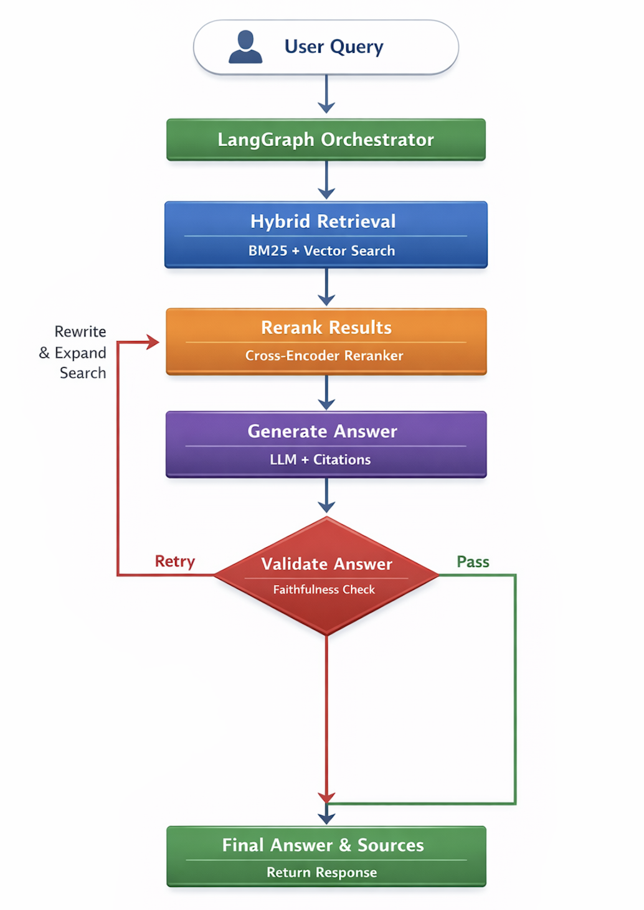

# 🔍 Adaptive Hybrid RAG Document Intelligence System


A **production-grade Retrieval-Augmented Generation (RAG) system** designed for document question answering with **hybrid retrieval, reranking, evaluation, and adaptive retry mechanisms**.

---

## 🚀 Overview

This project implements an **end-to-end RAG pipeline** that:

* Ingests and processes PDF documents
* Performs **hybrid retrieval (BM25 + vector search)**
* Improves relevance using **cross-encoder reranking**
* Generates answers with **LLM + citations**
* Evaluates outputs using **custom metrics + RAGAS (LLM-based evaluation)**
* Uses **LangGraph** for orchestration and retry logic
* Exposes a **FastAPI endpoint** for real-time querying

---

## 🧠 Key Features

### 🔹 Hybrid Retrieval

* Combines:

  * **BM25 (keyword search)**
  * **FAISS (semantic search)**
* Improves recall over single-method retrieval

---

### 🔹 Cross-Encoder Reranking

* Uses `ms-marco-MiniLM` cross-encoder
* Reorders retrieved chunks based on semantic relevance

---

### 🔹 Answer Generation with Citations

* LLM generates grounded answers
* Automatically attaches document + page references

---

### 🔹 Adaptive Retry Loop (LangGraph)

* Validates answers using **faithfulness scoring**
* Retries with:

  * Increased `top_k`
  * Query rewriting
* Prevents hallucinated responses

---

### 🔹 Evaluation Pipeline

#### ✅ Custom Metrics

* **Correctness** → similarity with ground truth
* **Faithfulness** → grounded in retrieved context
* **Recall** → expected document retrieved
* **Citation Accuracy** → correct source attribution

#### 🤖 LLM-Based Evaluation

* Integrated **RAGAS** for:

  * Faithfulness
  * Answer Relevancy

---

### 🔹 FastAPI Inference Service

* REST API for real-time querying
* Returns:

  * Answer
  * Sources (doc_id, page)
  * (Optional) latency

---

## 🏗️ System Architecture

```
User Query
   ↓
LangGraph Orchestrator
   ↓
Retrieve (Hybrid Search)
   ↓
Rerank (Cross Encoder)
   ↓
Generate Answer (LLM)
   ↓
Validate (Faithfulness Check)
   ↓
Retry (if needed)
   ↓
Final Answer + Citations
```

---

## ⚙️ Tech Stack

* Python
* FAISS (Vector Search)
* BM25 (Keyword Search)
* SentenceTransformers
* Cross-Encoder Reranking
* LangGraph
* FastAPI
* RAGAS (Evaluation)
* Groq LLM API

---

## 📊 Evaluation Results

| Metric        | Description                     |
| ------------- | ------------------------------- |
| Correctness   | Similarity with expected answer |
| Faithfulness  | Grounding in retrieved context  |
| Recall        | Retrieval success               |
| Citation      | Source accuracy                 |
| RAGAS Metrics | LLM-based evaluation            |

> The system includes a **quality gate** that fails if metrics fall below thresholds.

---

## 📁 Project Structure

```
.
├── hybrid_rag_pipeline.py   # Core RAG pipeline
├── RAG_Graph.py             # LangGraph orchestration
├── evaluation.py            # Evaluation + RAGAS
├── app.py                   # FastAPI service
├── data/
│   ├── raw_docs/            # Input PDFs
│   └── qa_dataset.json      # Evaluation dataset
```

---

## ▶️ Running the Project

### 1. Install Dependencies

```bash
pip install -r requirements.txt
```

---

### 2. Run API

```bash
uvicorn app:app --reload
```

---

### 3. Query API

```bash
curl -X POST http://127.0.0.1:8000/query \
-H "Content-Type: application/json" \
-d '{"query": "What are Non-Marketable Investments?"}'
```

---

## 🧪 Running Evaluation

```bash
python evaluation.py
```

---

## 💡 Design Highlights

* **Hybrid retrieval improves recall**
* **Reranking improves precision**
* **Retry loop improves answer quality**
* **RAGAS provides LLM-based evaluation**
* **Separation of concerns (pipeline, graph, API, evaluation)**

---

## 🚀 Future Improvements

* Query rewriting node (multi-query retrieval)
* Reciprocal Rank Fusion (RRF) for better hybrid ranking
* Streaming responses
* Vector DB persistence (FAISS disk storage)
* Frontend UI (chat interface)
* Deployment (Docker + Cloud)

---


