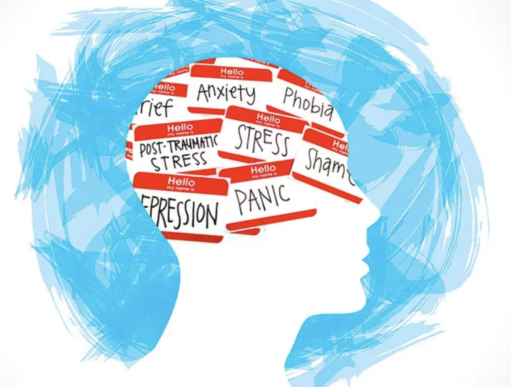

# Depression Detection  using NLP

## Welcome to the Depression Detection project! 🚀 🚀
### This project aims to analyze and predict depression using various supervised machine learning models.
## Features
- Logistic Regression
- KNN
- Decision tree
- Random forest
- Support Vector classifier(SVC)
- Naive Bayes

## **Data Dictionary**
Index: Id of a tweet

Message to examine:The message on which the Sentimental Analysis needs to be performed

label(depression result):Does the person have depression? 0 stands for NO and 1 stands for YES

## **Data Source**
https://www.kaggle.com/datasets/gargmanas/sentimental-analysis-for-tweets

https://www.kaggle.com/datasets/kazanova/sentiment140