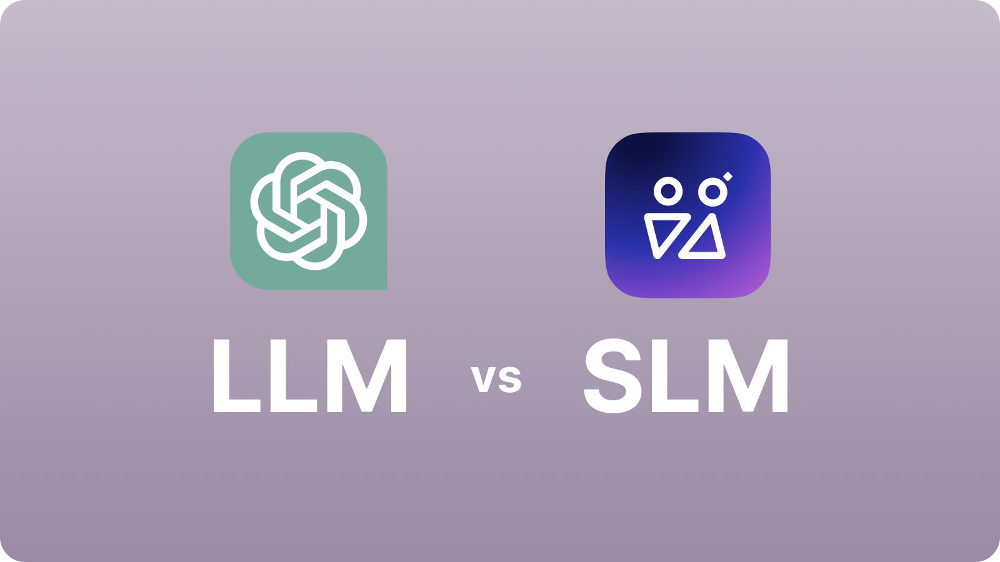
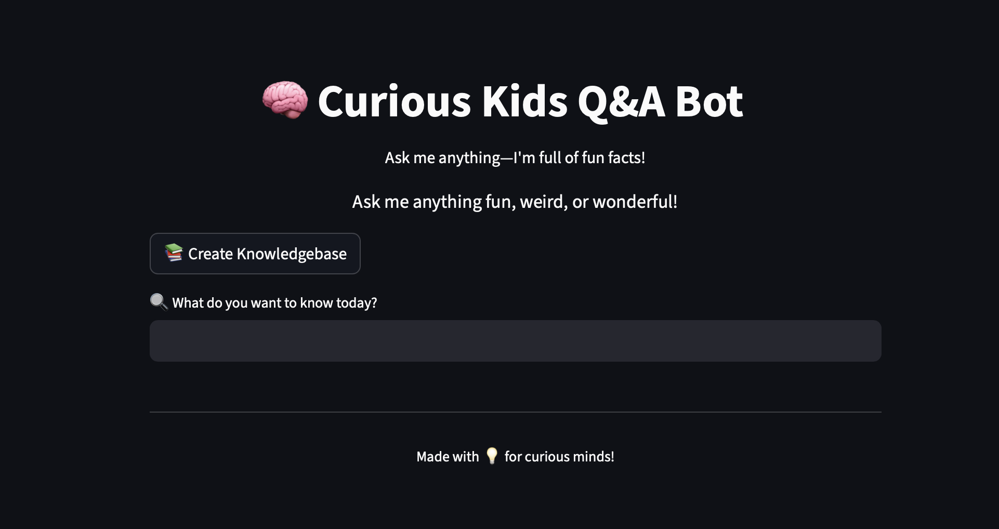
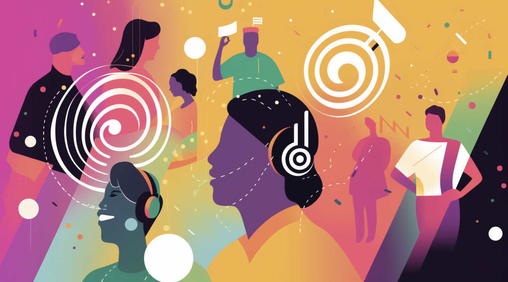
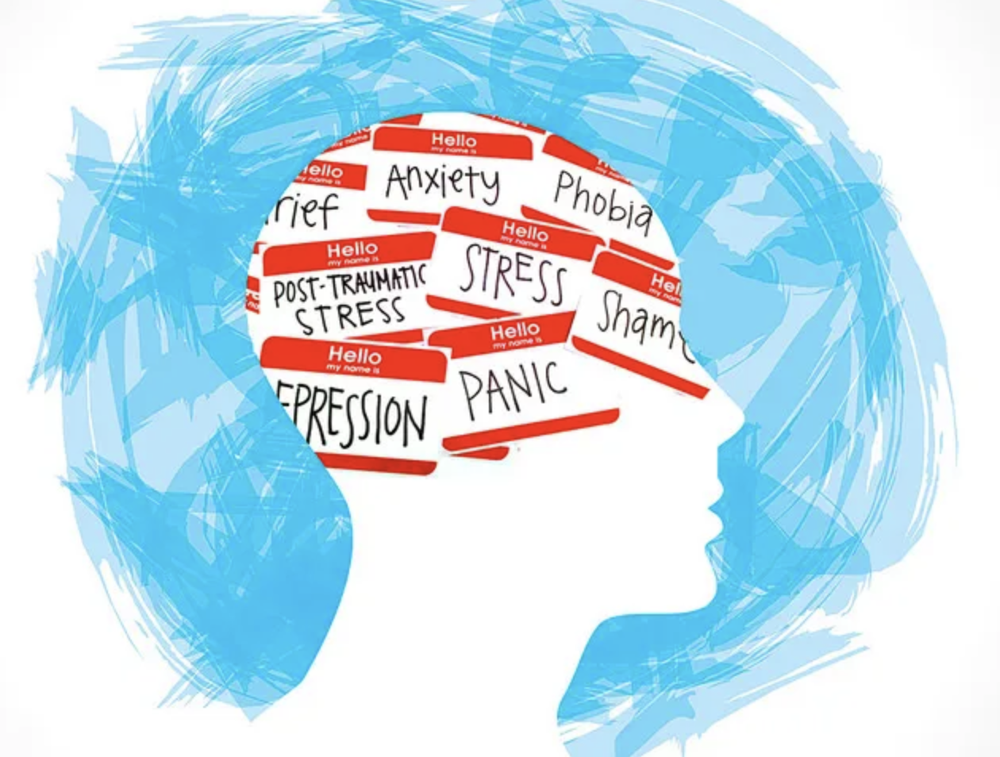

# DataScience_Workbench 
## 🚀 Welcome to my Data Science Portfolio! 

### This repository features projects that highlight my skills in data analysis, Python development, machine learning, and statistical modeling. Explore examples of data manipulation, predictive modeling, and insights from complex datasets, along with utilities to streamline daily tasks.

---

## 🛠️ Core Tech Stack

       ! 

---

## ✍️ Thought Leadership & Technical Writing
*Bridging the gap between childlike curiosity and professional AI engineering.*

| Category | Publication | Summary | Platform |
| :--- | :--- | :--- | :---: |
| **🔬 Primary Research** | [**Benchmarking Local SLMs vs. Cloud LLMs for Pedagogical Logic**](Projects/Maths_quiz_generator/Research_Paper.md) | A quantitative study on latency, TTFT, and cost-efficiency in educational AI. | [**Medium**](https://medium.com/@jayashree.lakshmi.jay/local-slms-vs-a5bf3b868f6f) |
| **🛠️ Engineering** | [**Building a Modular AI Story Generator with LangChain**](https://medium.com/@jayashree.lakshmi.jay/building-a-modular-ai-story-generator-with-langchain-a3c5c7c2f936) | Deep-dive into prompt chaining, modular architecture, and creative AI automation. | [**Medium**](https://medium.com/@jayashree.lakshmi.jay/building-a-modular-ai-story-generator-with-langchain-a3c5c7c2f936) |
| **💡 Philosophy** | [**Generative AI: A Childlike Curiosity Meets Technological Genius**](https://medium.com/@jayashree.lakshmi.jay/generative-ai-a-childlike-curiosity-meets-technological-genius-0e056386958a) | Exploring the intuitive nature of LLMs and how they mirror human learning patterns. | [**Medium**](https://medium.com/@jayashree.lakshmi.jay/generative-ai-a-childlike-curiosity-meets-technological-genius-0e056386958a) |

---

## 🏗️ Project Showcase

### 🤖 Generative AI & LLM Applications
*Advanced RAG pipelines, SLM benchmarking, and stateful AI agents.*

---
#### Project🔬: Adaptive Document Intelligence System using Hybrid RAG

Built a production-grade document intelligence system using hybrid retrieval (BM25 + vector search), cross-encoder reranking, and LLM-based answer generation with citations. Implemented adaptive retry logic using LangGraph and integrated both embedding-based and RAGAS-based evaluation to ensure answer faithfulness and relevance.

- **Tech Stack:** 

- [**End to End RAG Pipeline**](Projects/GenAI_projects/RAG_document_intelligence_system/README.md)

 

#### Project🔬:  Local SLMs vs. Cloud LLMs: A Quantitative Study

A technical research project evaluating the trade-offs between local execution and cloud-based inference.
- **Tech Stack:**   
- **Key Focus:** Benchmarking **Inference Logic** vs. **Operational Cost-Efficiency**.
- **Insight:** Developed a framework to quantify "Syntax Hallucination" and latency across different hardware tiers.
- [**Research Project**](Projects/GenAI_projects/Maths_quiz_generator/README.md)

 

#### Project📚: Kids Bedtime Story Generator

An interactive storytelling engine that creates personalized narratives and illustrations for children.
- **Tech Stack:**   
- **Key Focus:** Prompt engineering for moral extraction and creative consistency.
- **Feature:** Seamlessly integrates character traits and settings into high-quality generated tales.
- [**Explore Story Generator**](Projects/GenAI_projects/Kid_story_generator/README.md)

 

#### Project🧠: Curious Kids Q&A Bot (RAG Pipeline)

A robust Knowledge Retrieval system designed to answer complex questions using verified data.

- **Tech Stack:**   
- **Key Focus:** Semantic search and retrieval-augmented generation.
- **Architecture:** Employs a stateful graph to route queries between local vector stores and structured datasets.
- [**View RAG Implementation**](Projects/GenAI_projects/llm_pipeline/README.md)

 

---
---

### 🎯 Recommendation & Personalization Systems
*Building discovery engines through collaborative and content-based filtering.*

| Project | Preview | Core Algorithm | Link |
| :--- | :---: | :--- | :--- |
| **Music Recommender System 🎵** |  | Collaborative Filtering / KNN | [Read more](Projects/Music_recommender/README.md) |
| **Amazon Product Recommender 📦** |  | Matrix Factorization / SVD | [Read more](Projects/Amazon_product_recommender/README.md) |

---

### 📊 NLP & User Behavior Analysis
*Extracting sentiment and segments from unstructured text and transaction data.*

#### 🧠 Depression Detection [Sentiment Analysis]
 

Predicting mental health indicators using various supervised machine learning models. 
- **Models:** Logistic Regression, Random Forest, BERT.
- **Focus:** Analyzing linguistic patterns for early detection.
- [Read full report](Projects/Tweet_sentiment_analysis_supervisedML/README.md)

 

#### 👥 Customer Segmentation
 

Understanding customer behaviors, preferences, and demographics to enhance business strategies.
- **Method:** Unsupervised ML, K-Means Clustering, RFM Analysis.
- **Outcome:** Data-driven personas for targeted marketing.
- [Read full report](Projects/Customer_segmentation_unsupervisedML/README.md)

---

## 📈 Featured Research: Local SLM Efficiency

**Operational cost-efficiency of Local SLMs.** My latest benchmarks show that for specific pedagogical logic tasks, local 3B parameter models (like Phi-3) can maintain high instruction-following accuracy while reducing long-term API costs by over 90% compared to cloud-scale LLMs.

---