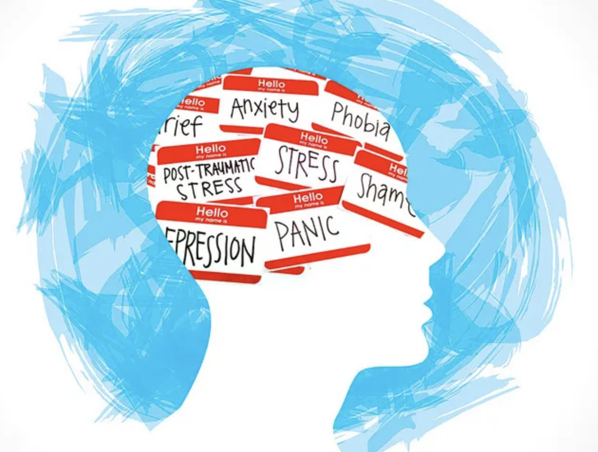

# DataScience_Workbench 
## Welcome to my Data Science Portfolio! 
### This repository features projects that highlight my skills in data analysis,Python development, machine learning, and statistical modeling. Explore examples of data manipulation, predictive modeling, and insights from complex datasets, along with utilities to streamline daily tasks.

# Projects

## Recommendation & Personalization Systems

###  Music Recommender System🎵  
 

#### A machine learning model that recommends music based on user preferences. [Read more](Projects/Music_recommender/README.md)

### Amazon Product Recommender📦

#### An analysis of Amazon product ratings and a recommendation system. [Read more](Projects/Amazon_product_recommender/README.md)

## NLP & User Behavior Analysis

###  Depression Detection using NLP [Sentiment Analysis]
 

#### This project aims to analyze and predict depression using various supervised machine learning models.[Read more](Projects/Tweet_sentiment_analysis_supervisedML/README.md)

### Customer Segmentation based on there purchasing history
 

#### Understanding customer behaviors, preferences, and demographics to enhance business strategies and customer experiences.[Read more](Projects/Customer_segmentation_unsupervisedML/README.md)

## Generative AI & LLM Applications

### Kids Bed time story generator using LLM
 

#### Generate whimsical, custom bedtime stories for kids using Python, LangChain, and OpenAI’s GPT magic! Just enter a character and setting—like _"Red car in F1 race"_—and the app will produce a personalized tale, extract a moral, and illustrate the scene.[Read more](Projects/Kid_story_generator/README.md)

###  LLM pipeline for  Curious Kids Q&A Bot application

#### Using Langchain openai, hugging face semantic search embedding, vectordb (FAISS),  Retrieval Chain combines retriever + prompt + LLM. [Read more](Projects/llm_pipeline/README.md)
